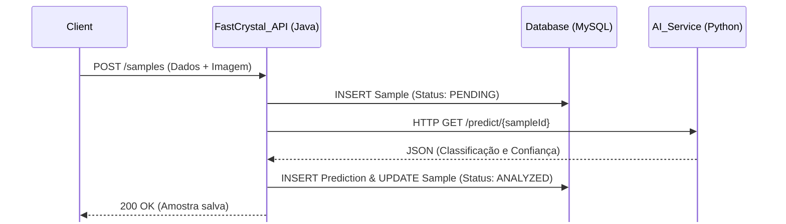

# FastCrystal API - Arquitetura Orientada a Serviços (SOA)

## Nome e RM dos Integrantes
* Gabriel Luni Nakashima - RM558096
* Gustavo Henrique - RM556712
* Milena Garcia - RM555111
* Renan Simões Gonçalves - RM555584
* Vinicius Vilas Boas - RM557843

---

## Descrição da Solução Proposta
O FastCrystal é uma plataforma integrada para gerenciamento e análise de experimentos de cristalização de proteínas realizados em ambiente de microgravidade espacial. A solução é composta por quatro componentes principais que se comunicam por meio de uma arquitetura orientada a serviços (SOA).

---

## Problema que Será Resolvido
O crescimento de cristais de proteínas em microgravidade é uma das aplicações mais promissoras da exploração espacial para a medicina moderna. Estruturas cristalinas formadas em ambiente espacial são mais estáveis e organizadas do que aquelas obtidas em laboratórios terrestres, permitindo compreender melhor moléculas complexas e contribuindo para o desenvolvimento de novos medicamentos.

---

## Objetivos da Aplicação
* **Centralização de Dados:** Prover um repositório único e confiável (banco de dados relacional) para todas as amostras cadastradas.
* **Orquestração de Serviços:** Desacoplar a lógica pesada de Visão Computacional do serviço de cadastro de dados, permitindo que cada sistema escale de forma independente.
* **Acessibilidade:** Expor endpoints estruturados para que painéis de controle (front-end) possam consumir os dados e o status das amostras de forma fácil.
* **Avaliação de Eficiência:** Calcular automaticamente um *score* de eficiência do experimento baseado nas variáveis físicas (temperatura, vibração mecânica).

---

## Diagrama de Arquitetura SOA

## Explicação da API REST
O serviço expõe endpoints RESTful seguindo as melhores práticas do protocolo HTTP:

* **`POST /samples`**: Recebe os dados de telemetria e o arquivo de imagem (`multipart/form-data`). Salva no disco, persiste no banco, chama a IA e retorna o objeto completo.
* **`GET /samples`**: Retorna a lista de todas as amostras cadastradas, mapeadas para DTOs (Data Transfer Objects), incluindo o cálculo de eficiência e a última predição da IA.
* **`GET /samples/{id}`**: Retorna os detalhes de uma amostra específica.
* **`PUT` e `DELETE`**: Endpoints para manutenção dos registros.

## Explicação da Integração entre os Serviços
A comunicação entre o back-end Java e o serviço de visão computacional Python é o coração do projeto. 
Foi utilizado o `RestTemplate` do Spring Boot para realizar uma requisição HTTP síncrona. O fluxo ocorre da seguinte maneira:

1. O método `createSample` no `SampleService` persiste a amostra.
2. Imediatamente após, o Java faz um "call" para `http://localhost:8000/predict/{sampleId}`.
3. O JSON de resposta da FastAPI é automaticamente deserializado (usando a anotação `@JsonProperty` do Jackson) para os DTOs `FastApiPredictionDto` e `FastApiResultDto`.
4. Os dados retornados (ex: "Precipitate", 86% de confiança) são transformados em uma entidade `Prediction` e salvos de forma relacional no MySQL.

## Tecnologias Utilizadas
* **Java 17+**: Linguagem de programação principal do serviço.
* **Spring Boot (Web, Data JPA)**: Framework para injeção de dependências, criação dos endpoints REST e mapeamento objeto-relacional.
* **MySQL**: Banco de Dados Relacional.
* **Jackson**: Biblioteca para parsing e serialização de JSON/Objetos.
* **Maven**: Gerenciador de dependências e build do projeto.
* **Postman**: Para testes de requisição de API.

## Conclusão do Projeto
O desenvolvimento do **FastCrystal API** demonstrou na prática as vantagens da Arquitetura Orientada a Serviços (SOA). Conseguimos criar um ecossistema onde o pesado processamento de redes neurais (Python) não afeta a performance e a estabilidade das requisições transacionais de cadastro de telemetria (Java). O sistema final é escalável, altamente coeso e apresenta um fluxo de ponta a ponta automatizado. Alcançamos com êxito o objetivo de proteger e monitorar experimentos de altíssimo valor de forma autônoma.
